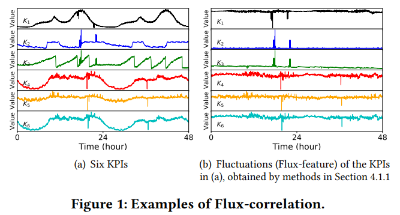

# CoFlux总结

## 1. 算法原理

论文链接: https://netman.aiops.org/wp-content/uploads/2019/05/CoFlux_camera-ready1.pdf



主要思想是通过预测时间序列值与原始值相减得到一个波动序列, 然后对于不同kpi所产生的波动序列计算其相关性. 算法主要采取多种detector计算预测值, 然后两两计算得到相关性得出序列是否波动相关

## 2. 实验结果

### part1. detector实现部分

数据集:https://github.com/zhouhaoyi/ETDataset

1. detector有效性验证
   1. holt winters
      1. 使用from statsmodels.tsa.api import ExponentialSmoothing
      2. 对应参数 trend: add , seasonal: add , smooth_level: 0.9 , smooth_trend: 0.07 , smooth_seasonal: 0.4
      3. 实验效果 mape: 6.549778903638727，rmse: 2.8968762791358587
   2. diff 
      1. 参数为一天
      2. mape: 5.799476944450385，rmse: 2.689846310264068
   3. history average
      1. 窗口为一天
      2. mape: 3.172640049982791 rmse: 1.5212308953443703
   4. wavelet
      1. mape: 7.080522197996979 rmse: 3.0391395905240555
   5. std
      1. mape: 4.080976944450385 rmse: 1.8984590524055523

2. detector实现

   1. tsd median 时间序列分解 然后将残差的中位数作为波动值 1,2,3,4周
   2. tsd 时间序列分解 然后将残差作为波动值 1,2,3,4周
   3. diff 差分，跨度为1或者7天
   4. history average 历史平均 窗口1,2,3,4周
   5. history median 历史中值 窗口1,2,3,4周
   6. holt winters 将参数分别设置为0.2 0.4 0.6 0.8 实际产生64个detector
   7. wavelet 做小波分解预测 每次预测步长为5 窗口1,3,5,7天

3. correlation_measurement

   1. 由上述86个detector构成的特征引擎输出86*2组波动序列, 放入Correlation measurement相关性检测得到结果

   2. 测试用例:

      ```
      [[0, 0, 0, 1, 2, 3, 4, 5, 4, 3, 2, 1, 0, 0, 0]]
      ```

      ```
      [[1, 0, 0, 0, 0, 0, 0, 0, 0, 0, 0, 0, 0, 0, 0]],
      [[0, 0, 1, 2, 3, 4, 5, 4, 3, 2, 1, 0, 0, 0, 0]],
      [[0, 0, 0, 1, 2, 3, 4, 5, 4, 3, 2, 1, 0, 0, 0]],
      [[0, 0, 0, 0, 1, 2, 3, 4, 5, 4, 3, 2, 1, 0, 0]],
      [[0, 0, -1, -2, -3, -4, -5, -4, -3, -2, -1, 0, 0, 0, 0]],
      [[0, 0, 0, -1, -2, -3, -4, -5, -4, -3, -2, -1, 0, 0, 0]],
      [[0, 0, 0, 0, -1, -2, -3, -4, -5, -4, -3, -2, -1, 0, 0]]，
      [[-5, -4, -3, -2, -1, 0, 0, 0, 0, 0, 0, 0, 0, 0, 0]]
      ```

      输出:

      1. xy不相关
      2. xy正相关 有时序关系,x相对y右移
      3. xy正相关 无时序关系
      4. xy正相关 有时序关系,x相对y左移
      5. xy负相关 有时序关系,x相对y右移
      6. xy负相关 无时序关系
      7. xy负相关 有时序关系,x相对y左移
   
   4. correlation_measurement
   
      1. 由于实际数据缺少波动相关性的标注, 所以正确性验证上使用余弦函数构造时间序列
   
      2. 测试时对于holtwinters只采取一套参数
   
      3. ListA:np.sin(x * np.pi)
   
         1. | listB                           | cm值                 | 相关性 | 时序性 | 耗时                |
            | ------------------------------- | -------------------- | ------ | ------ | ------------------- |
            | np.sin(x * np.pi + 0.8 * np.pi) | -0.34563121343162095 | -1     | 2      | 225.11403703689575s |
            | np.sin(x * np.pi + 0.6 * np.pi) | -0.3129206887590068  | -1     | 4      | 221.07005524635315s |
            | np.sin(x * np.pi + 0.4 * np.pi) | 0.3419823987594188   | 1      | -4     | 222.78151965141296s |
            | np.sin(x * np.pi + 0.2 * np.pi) | 0.3551635361703965   | 1      | -2     | 220.87513399124146s |
            | np.sin(x * np.pi - 0.2 * np.pi) | 0.3447770350290061   | 1      | 2      | 222.64587020874023s |
            | np.sin(x * np.pi - 0.4 * np.pi) | 0.30981795923066213  | 1      | 4      | 221.1571922302246s  |
            | np.sin(x * np.pi - 0.6 * np.pi) | -0.3399939585548947  | -1     | -4     | 218.01109862327576s |
            | np.sin(x * np.pi - 0.8 * np.pi) | -0.354684820001268   | -1     | -2     | 218.02944779396057s |
            | np.sin(x * np.pi - 1.0 * np.pi) | -0.35870389110469286 | -1     | 0      | 222.45838928222656s |

## 3. 运行文档

1. pip安装requirements.txt

2. 代码地址:https://github.com/XLab-Tongji/MultivariateAnalysis/tree/main/src.CoFlux
   1. Measure.py实现CorrelationMeasurement计算相关性
   2. predict_realization.py实现特征引擎
   3. verify.py实现测试数据的输入

## 4. 总结

1. 优点
   1. detector数量多,对于各种场景下的数据集都有着一定的适用性
   2. detector实际上可以简答的扩充, 若有需要可以随时增加
   3. detector可解释性强
   4. 相关性计算部分简单易懂,公式清楚,可解释性强
2. 缺点
   1. 采用86个detector,对于O(n<sup>2</sup>)来说时间消耗大
   2. 计算相关性的时对于整个序列做位移计算相关性,复杂度高,现在改进为基于两倍的周期位移进行复杂度计算
   3. 不同detector产出的时间序列长度不同,需要对齐,在对齐过程中会损失信息