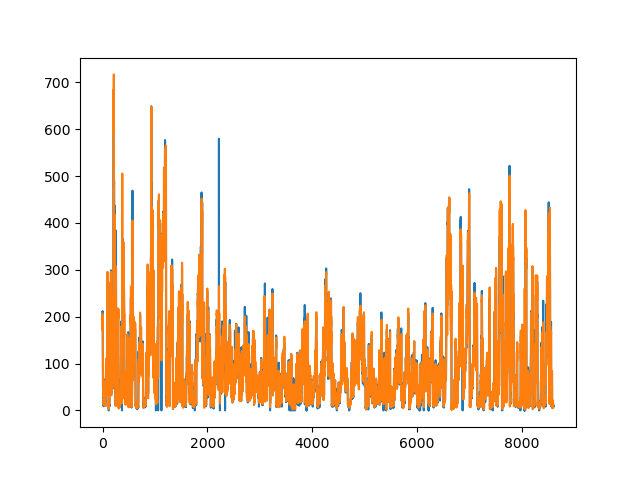
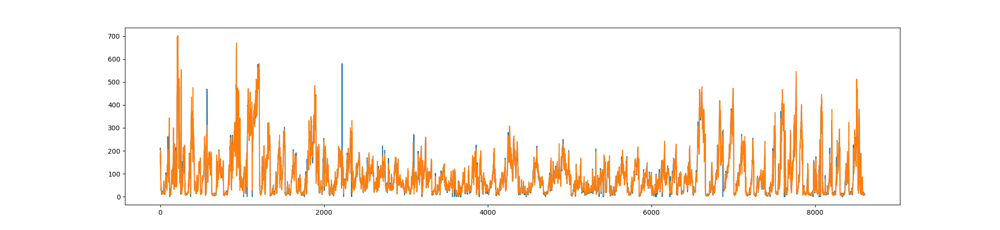

# CodeExperiment

1. 简述

   这周主要是是实现上周周报中提到的LSTNet，主要是改变输入输出

   paper https://arxiv.org/pdf/1703.07015.pdf 

2. requirement

   * Python 3.6.0
   * Keras 2.2.0
   * tensorflow/tensorflow-gpu 1.13.1
     * cuda 10.0
     * cudnn 7.4.2
   * h5py 2.10
   * 其他包直接默认pip install就可以

3. Code 

   │  Config.py
   │  pollution.csv
   │  Result.png
   │  Show.py
   │  StartTest_LSTNet.py
   │  StartTrain_LSTNet.py
   │  test.py
   │
   ├─lstm
   │  │  LSTNet_Interface.py
   │  │  Predict_Interface.py
   │  │
   │  └─__pycache__
   │          LSTNet_Interface.cpython-36.pyc
   │          Predict_Interface.cpython-36.pyc
   │
   └─__pycache__
           Config.cpython-36.pyc
           StartTest_LSTNet.cpython-36.pyc

4. 实验结果

   为了节约训练时间，使用pollution数据集80%训练，20%测试

   测试结果如下：

   

   

   5. 小结
      * 这周工作中没有找到更多和多维关联分析的demo，所以直接使用上周的LSTNet做预测，之后在实现CoFlux中的FCC函数得到相关性结论
      * 使用GPU计算的过程中利用率低，调高batch_size影响也不是很明显，需要优化（可能更多是config层面）

