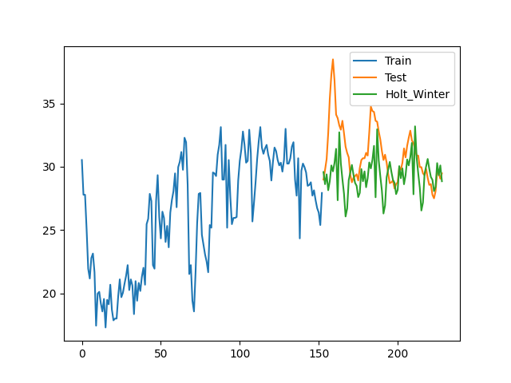
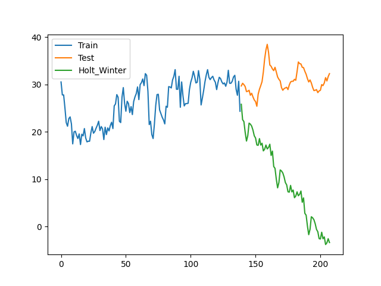
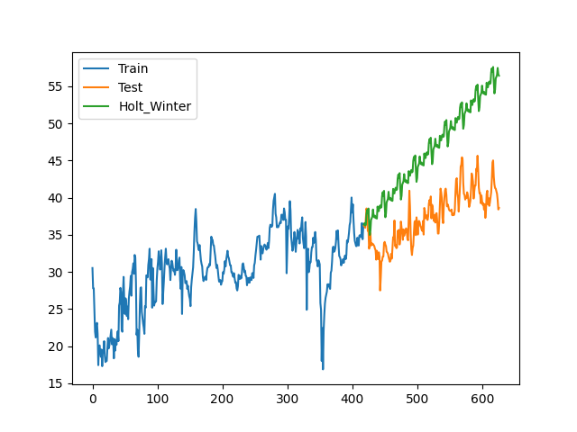
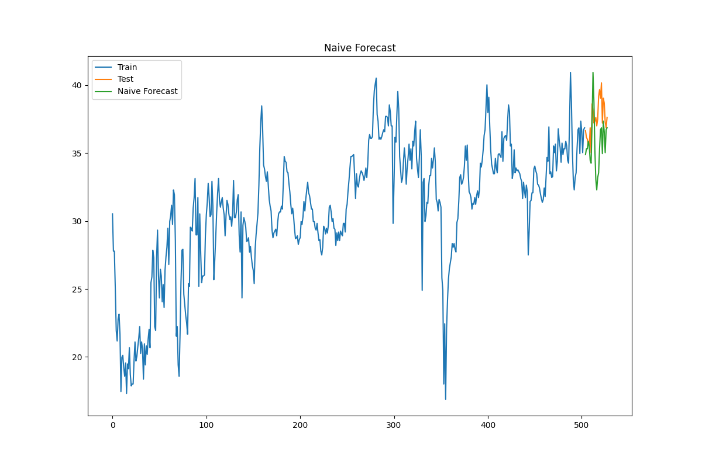
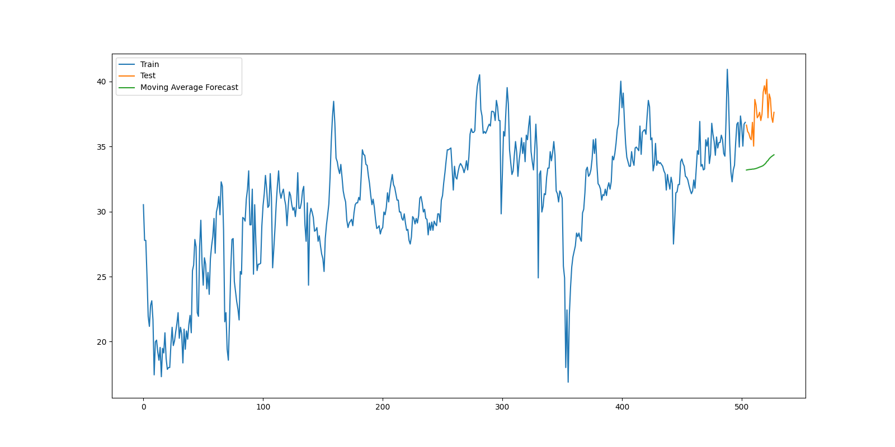
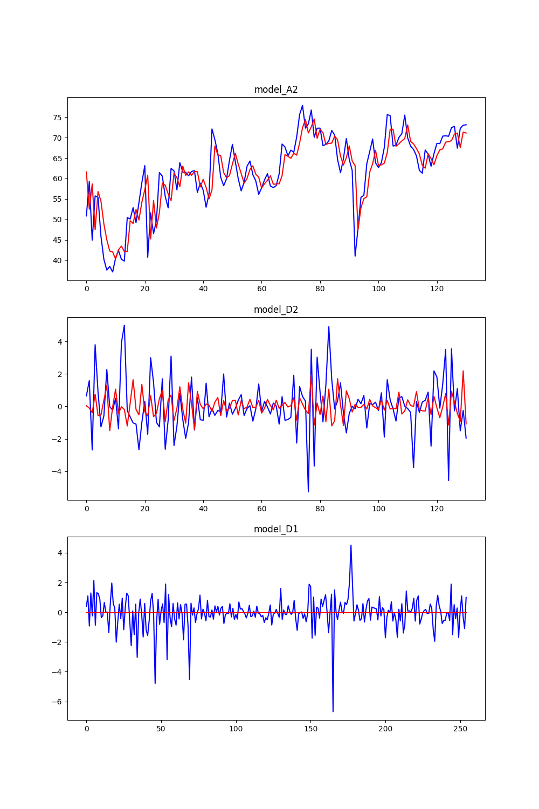
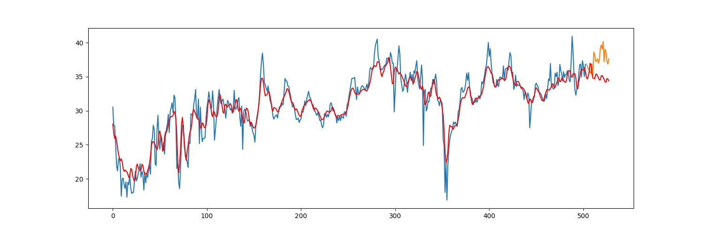

#  week3 CoFlux detector 算法实验

1. 使用数据集https://github.com/zhouhaoyi/ETDataset
2. 环境 python3.6.0
3. holt winters

   * 使用from statsmodels.tsa.api import ExponentialSmoothing
   * 对应参数 trend: add , seasonal: add , smooth_level: 0.9 , smooth_trend: 0.07 , smooth_seasonal: 0.4（不同数据集需要重新调）
   * 实验效果图1

     * 
     * mape: 6.549778903638727，rmse: 2.8968762791358587
   * 实验效果图2（参数不变修改开始预测的位置）

     * 
     * mape: 68.68091930036833，rmse: 23.016227422423203
   * 问题在于开始预测的位置如果刚好下降趋势很严重导致整个预测结果垮掉
   * 而且这个算法预测的范围只能往后预测一点点的范围，再远了数据会非常离谱
   * 如下图

3. diff

   同样只能对于短时间预测（预测一天24h）使用的是一天前的数据预测

   mape: 5.799476944450385，rmse: 2.689846310264068

   

   

4. 历史平均

   历史平均预测使用的数据是越近越好，窗口越小效果越好，预测效果收到异常值影响很大

   窗口太大的时候或许可以考虑加入不同比例的权重来影响结果提升效果

   * 窗口一天
   * mape: 3.172640049982791 rmse: 1.5212308953443703

   

   * 窗口一周
   * mape: 10.355431795120996 rmse: 4.105219590996519
   * 

5. wavelet

   * mape: 7.080522197996979 rmse: 3.0391395905240555

     

     

6. 小结

   对于多种方法进行了尝试，发现不同参数情况下同一个模型结果差距非常大，对于同一组参数，开始预测的位置不同也影响很大。需要循环遍历找一组最普适的参数。基本上对于预测来说预测时间段一般越短越好，对于长时间预测的结果一般比较不好。

   tsd我找到的实现有一些问题且他本身的example也跑不起来，我改不出bug这个算法没实现出来

   

