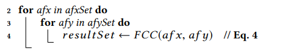
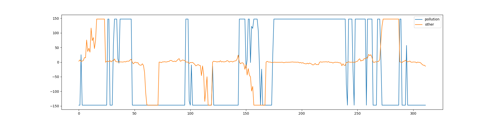
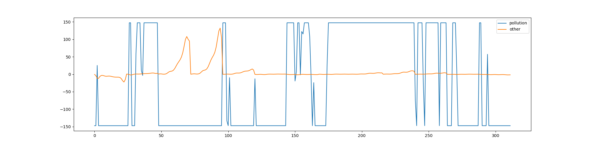

# week5 CoFlux process implementation

实现了两种方法完成预测并求出波动相关性（wavelet,holt_winter)

1. 算法修改

   在相关性检测步骤中，论文中

   这里是双循环找到FCC极值，这样会导致不同时间的序列被匹配上，所以我修改了代码如下所示，使得两个序列是在相同时间被比较

   ```python
   for i in range(length):
       afx = afx_set[i]
       afy = afy_set[i]
       l1 = self.amplification(0.5, 10, afx)
       l2 = self.amplification(0.5, 10, afy)
       result_set.append(self.FCC(l1, l2))
   ```

2. holt_winter实现

   在实现holt_winter过程中，虽然在能够在局部选择出最好的参数，但是缺少选择全局最好参数的方法。

   另外，由于pollution变化较大，而且其本身绝对数值相比其他参数也较大，所以导致预测的结果往往偏差值较大，所以采用两种方法做测试，先不对于数据做标准化处理，然后对于他max_min标准化然后在做波动相关性检测。

   另外，考虑到之前实验中发现只有预测长度小的时候有效性才足够，所以预测长度设置为24（一天），将得到的多个小序列的list输入week4的波动相关检测中

3. wavelet实现

   直接套用week3中的实现，但是对于得到的长序列切分成长度为24的小序列，将小序列的list输入week4的波动相关检测中

4. 结果（目标指标 pollution）

   * 这周主要目标是跑通算法而不是对于算法调优，所以只选用小规模数据，另外对于参数选择没有达到最优解
   * 另外选择的波动检测范围比较小（24）可能也是影响结果的原因之一
   * rain列全是0没有考虑
   * 结果上看，结果max_min标准化后holt_winter和wavelet结果一样，不标准化只有snow不一样

   holt_winter(raw)

   * pollution(检测自己)  x<-+->y
   * dew                            x<--->y
   * temp                          x<--->y
   * press                          x<--->y
   * wnd_spd                    x<--->y
   * snow                          x<-+->y

   holt_winter(max_min)

   * pollution(检测自己)  x<-+->y
   * dew                            x<-+->y
   * temp                          x<-+->y
   * press                          x<-+->y
   * wnd_spd                   x<--->y
   * snow                         x<--->y

   wavelet

   * pollution(检测自己)  x<-+->y
   * dew                            x<--->y
   * temp                          x<--->y
   * press                          x<--->y
   * wnd_spd                   x<--->y
   * snow                         x<--->y

   wavelet（max_min)

   * pollution(检测自己)  x<-+->y
   * dew                            x<-+->y
   * temp                          x<-+->y
   * press                          x<-+->y
   * wnd_spd                   x<--->y
   * snow                         x<--->y

5. 部分图片

   使用holt_winter(raw)两列数据(pollution-dew）波动放大之后的结果

   

   使用holt_winter(raw)两列数据(pollution-snow）波动放大之后的结果

   

   实际输出有些与预期不符，可能的原因是之前提到的波动比较窗孔选择太小，之后可以选择7*24或者更大来完成

   

   