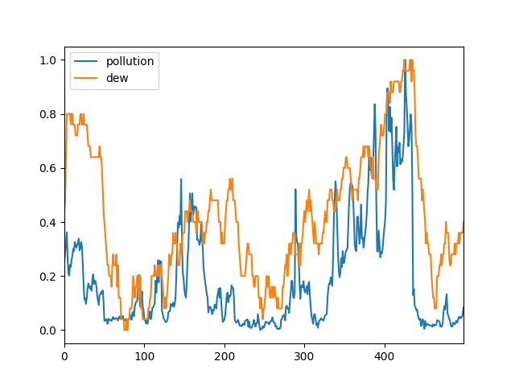
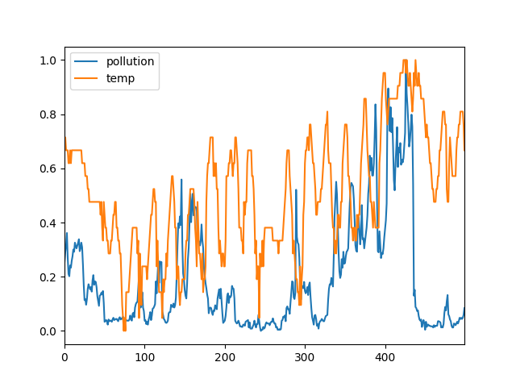
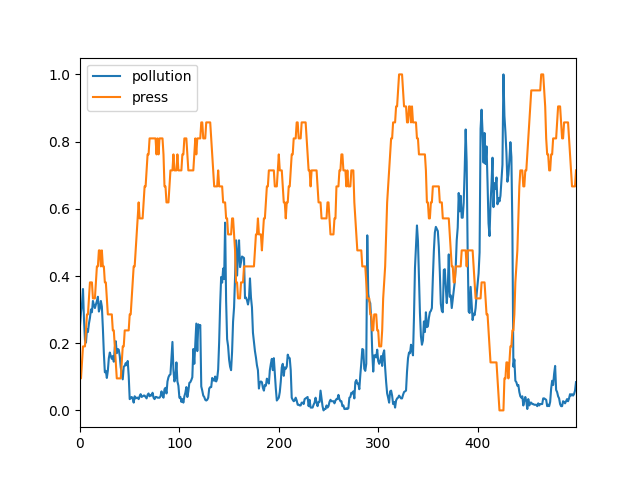
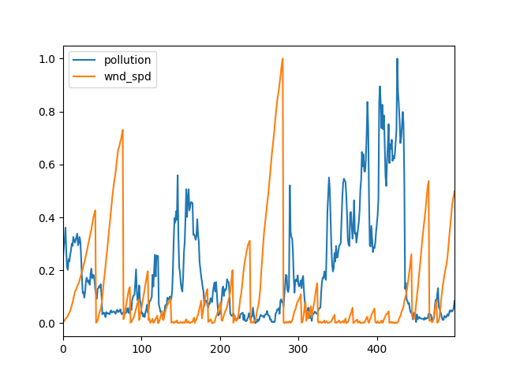
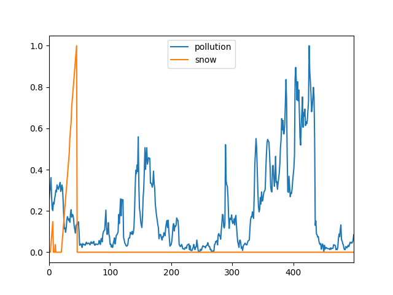

# week6_detector_selector

1. 相关性标记符号修改

   改为(1,-1)这种形式，前者表示是否有相关性，1和-1表示正负相关，0表示无关，后者表示时序性，1表示正向偏移，-1表示负向，0表示没有偏移

2. ground truth 推测

   * pollution - dew

     正相关 有一点点时序

   

   * pollution -temp

     负相关可能性大 另外一种可能是是正相关同时有时序关系

   

   * pollution - press

     负相关

   

   * pollution - wnd_spd

     正或负相关 有时间前后性

   

   * pollution - snow

     看不出相关性

   

   ​	根据上述推测，将上述修改成

   ​	pollution - dew

   ​	1，1

   ​	pollution - temp

   ​	1，1

   ​	pollution - press

   ​	-1，0
   
   ​	pollution - wnd_spd
   
   ​	-1，1
   
   ​	pollution - snow
   
   ​	0，0
   
3. 在对应的序列上运行4种detector，得到每种detector认为的相关性结果

4. 将结果与ground truth比对，形成二维数组，之后可以做持久化，然后在运行实际程序的时候读取该数据，使用对应的detector

5. 另外，有时候可能会出现部分极端值影响结果的情况，这部分或许可以用随机森林的思想选出占比最多的情况作为结果
