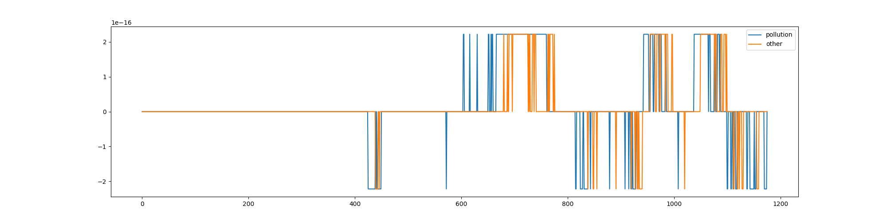
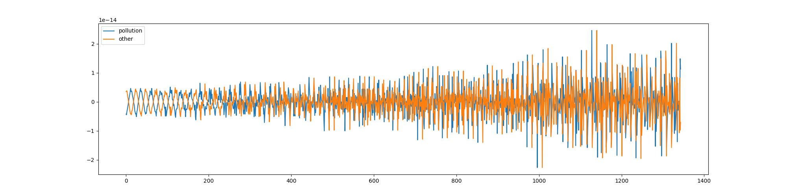

# Week8_Verify

1. 对于detector分别做验证

2. 模拟数据，使用正弦函数得到[-1,1]的值，将周期分为24，第一列数据起始角度为0°，第二列数据起始角度为-30°，第三列数据为-180°

3. 结果

   2. history_average（1，2，3，4week）

      四种参数选择结果相同

      | 测试数据     | 测试结果  | 预期结果  |
      | ------------ | --------- | --------- |
      | 序列1和序列2 | （1，1）  | （1，1）  |
      | 序列1和序列3 | （-1，0） | （-1，0） |

   2. history_median（1，2，3，4week）

      1234week在本例上是等价的，只取1week的情况

      | 测试数据     | 测试结果  | 预期结果  |
      | ------------ | --------- | --------- |
      | 序列1和序列2 | （1，1）  | （1，1）  |
      | 序列1和序列3 | （-1，0） | （-1，0） |

   3. diff

      对于构造的周期序列，一周和一天的差分结果是一样的，认为是等价的，所以只测试一周的差分

      | 测试数据     | 测试结果  | 预期结果  |
      | ------------ | --------- | --------- |
      | 序列1和序列2 | （1，1）  | （1，1）  |
      | 序列1和序列3 | （-1，0） | （-1，0） |

   4. tsd_median

      分解出的噪声序列基本是0，若存在基本是因为浮点数计算的误差导致的，下图可见1e-16，而且当序列长度变长的时候趋近0，这部分应该选择别的数据集测试

      | 测试数据           | 测试结果 | 预期结果  |
      | ------------------ | -------- | --------- |
      | 序列1和序列2 1week | （1，1） | （1，1）  |
      | 序列1和序列2 2week | （1，1） | （1，1）  |
      | 序列1和序列2 3week | （0，0） | （1，1）  |
      | 序列1和序列2 4week | （0，0） | （1，1）  |
      | 序列1和序列3 1week | （1，1） | （-1，0） |
      | 序列1和序列3 2week | （0，0） | （-1，0） |
      | 序列1和序列3 3week | （0，0） | （-1，0） |
      | 序列1和序列3 4week | （0，0） | （-1，0） |

      

   5. tsd

      由于本身正弦函数表现出稳定的周期性，所以在时间序列分解的过程中得到的结果将周期性中小部分认为是噪声，在下面的图中可以发现这个值在1e-14

      | 测试数据           | 测试结果  | 预期结果  |
      | ------------------ | --------- | --------- |
      | 序列1和序列2 1week | （1，1）  | （1，1）  |
      | 序列1和序列2 2week | （1，1）  | （1，1）  |
      | 序列1和序列2 3week | （1，1）  | （1，1）  |
      | 序列1和序列2 4week | （1，1）  | （1，1）  |
      | 序列1和序列3 1week | （-1，0） | （-1，0） |
      | 序列1和序列3 2week | （1，1）  | （-1，0） |
      | 序列1和序列3 3week | （1，1）  | （-1，0） |
      | 序列1和序列3 4week | （1，1）  | （-1，0） |

      

   6. wavelet

      效率太低只测试一组，结果也不太对

      | 测试数据     | 测试结果 | 预期结果  |
      | ------------ | -------- | --------- |
      | 序列1和序列2 | （1，0） | （1，1）  |
      | 序列1和序列3 | （1，0） | （-1，0） |

   7. holtwinters

      参数选择过多，选择0.5，0.5，0.5

      | 测试数据     | 测试结果  | 预期结果  |
      | ------------ | --------- | --------- |
      | 序列1和序列2 | （1，1）  | （1，1）  |
      | 序列1和序列3 | （-1，0） | （-1，0） |
      | 序列1和序列2 | （1，1）  | （1，1）  |
      | 序列1和序列3 | （-1，0） | （-1，0） |