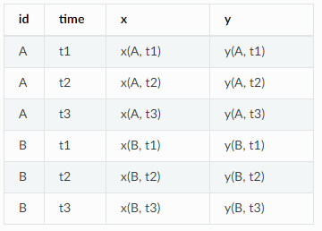
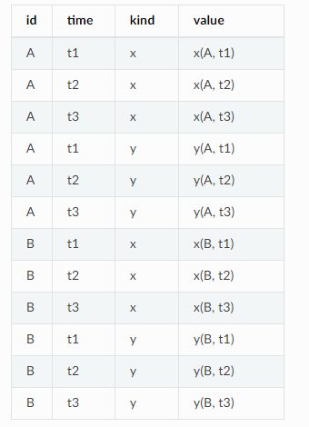
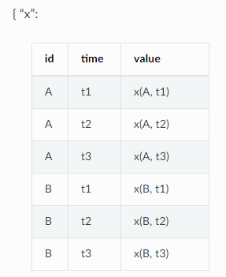
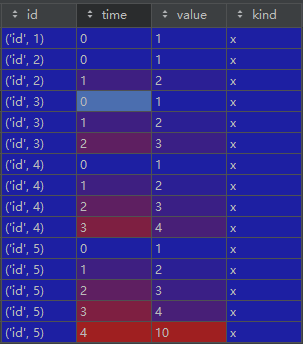
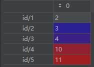

# week9

## 修改Coflux

1. 修改计算相关性部分部分的逻辑

2. 修改对应detector

3. 保证数据对齐

   1. 首先确保后半段对齐
   2. 然后对于非tsd的部分取[:-12]

4. 关于小波变换存在一个bug 样例中的一天的样本量太小，无法分解出有效的信息


## tsfresh

核心函数 tsfresh.extract_features

### 数据格式

1. 构成dataframe的元素
   1. column_id 表述时间序列的主体是谁
   2. column_sort 对于时间序列排序的值 没有的话默认升序
   3. column_value 实际值
   4. column_kind 不同序列的名称

2. 三种dataframe

   1. column_value 和kind=none

      

   2. value和kind都不是none

      

   3. value不是none

      

3. 输出是一个dataframe 每一行都是id对应的特征 数量非常多

### 设置选择的特征

```python
fc_parameters  =  { 
    “ length” ： 无，
    “ large_standard_deviation” ： [{ “ r” ： 0.05 }， { “ r” ： 0.1 }] 
}
```

通过字典来设置输出哪些特征

除此之外还有预定义的特征

- tsfresh.feature_extraction.settings.ComprehensiveFCParameters：（默认值）包括不带参数的所有功能以及带参数的所有功能，每个功能具有不同的参数组合。 
- MinimalFCParameters：仅包含少数功能，可用于快速测试。
- tsfresh.feature_extraction.settings.EfficientFCParameters：大多数功能与 ComprehensiveFCParameters相同，但没有标有high_comp_cost属性。

**补充说明**：使用官方给的样例的结果，6个属性，输出的特征数量4722个，即使经过过滤也还有600多个，实际上在使用这个库的时候应该先明确使用的特诊的种类，在使用下文的自定义特诊选择合适的特诊

### 局部极值相关的属性和部分函数

### https://tsfresh.readthedocs.io/en/latest/text/list_of_features.html

（若同时有大于和小于的情况只展示大于或者最大值）

| [`benford_correlation`](https://tsfresh.readthedocs.io/en/latest/api/tsfresh.feature_extraction.html#tsfresh.feature_extraction.feature_calculators.benford_correlation)(x) | Useful for anomaly detection applications                    |
| ------------------------------------------------------------ | ------------------------------------------------------------ |
| [`count_above`](https://tsfresh.readthedocs.io/en/latest/api/tsfresh.feature_extraction.html#tsfresh.feature_extraction.feature_calculators.count_above)[x，t） | 返回x中大于t的值的百分比                                     |
| [`count_above_mean`](https://tsfresh.readthedocs.io/en/latest/api/tsfresh.feature_extraction.html#tsfresh.feature_extraction.feature_calculators.count_above_mean)（X） | 返回x中高于x均值的值的数量                                   |
| [`first_location_of_maximum`](https://tsfresh.readthedocs.io/en/latest/api/tsfresh.feature_extraction.html#tsfresh.feature_extraction.feature_calculators.first_location_of_maximum)（X） | 返回x最大值的第一个位置。                                    |
| [`has_duplicate_max`](https://tsfresh.readthedocs.io/en/latest/api/tsfresh.feature_extraction.html#tsfresh.feature_extraction.feature_calculators.has_duplicate_max)（X） | 检查是否多次观察到x的最大值                                  |
| [`kurtosis`](https://tsfresh.readthedocs.io/en/latest/api/tsfresh.feature_extraction.html#tsfresh.feature_extraction.feature_calculators.kurtosis)（X） | 返回x的峰度（通过调整后的Fisher-Pearson标准化矩系数G2计算）。 |
| [`last_location_of_maximum`](https://tsfresh.readthedocs.io/en/latest/api/tsfresh.feature_extraction.html#tsfresh.feature_extraction.feature_calculators.last_location_of_maximum)（X） | 返回x最大值的相对最后位置。                                  |
| [`maximum`](https://tsfresh.readthedocs.io/en/latest/api/tsfresh.feature_extraction.html#tsfresh.feature_extraction.feature_calculators.maximum)（X） | 计算时间序列x的最大值。                                      |
| [`median`](https://tsfresh.readthedocs.io/en/latest/api/tsfresh.feature_extraction.html#tsfresh.feature_extraction.feature_calculators.median)（X） | 返回x的中位数                                                |
| [`number_cwt_peaks`](https://tsfresh.readthedocs.io/en/latest/api/tsfresh.feature_extraction.html#tsfresh.feature_extraction.feature_calculators.number_cwt_peaks)[x，n） | x中不同峰的数量。                                            |
| [`number_peaks`](https://tsfresh.readthedocs.io/en/latest/api/tsfresh.feature_extraction.html#tsfresh.feature_extraction.feature_calculators.number_peaks)[x，n） | 计算时间序列x中至少支持n的峰数                               |
| [`range_count`](https://tsfresh.readthedocs.io/en/latest/api/tsfresh.feature_extraction.html#tsfresh.feature_extraction.feature_calculators.range_count)（x，最小，最大） | 在间隔[min，max）内计数观察值。                              |

### 自定义特征

1. 简单特征   

   ```python
   def your_feature_calculator(x, p1, p2, ...)
   ```

   x是要计算特诊的时间序列

   p1234是自定义参数

   return type: bool, int or float

2. 组合特征  

   ```python
   def your_feature_calculator(x, param)
   ```
   
   x是时间序列
   
   param是字典 有多个参数
   
   返回值是一个序列，对应x的不同特征的结果

3. 添加到字典CompositeFCParameters 中

### 时间序列滚动/预测

1. 滚动

   1. 对于这样的一个dataframe 滚动得到的结果是如3所示 在此基础之上进行特征提取

   2. | id   | time | x    | y    |
      | ---- | ---- | ---- | ---- |
      | 1    | 1    | 1    | 5    |
      | 1    | 2    | 2    | 6    |
      | 1    | 3    | 3    | 7    |
      | 1    | 4    | 4    | 8    |
      | 2    | 8    | 10   | 12   |
      | 2    | 9    | 11   | 13   |

   3. | id    | time | x    | y    |
      | ----- | ---- | ---- | ---- |
      | (1,1) | 1    | 1    | 5    |

      | id    | time | x    | y    |
      | ----- | ---- | ---- | ---- |
      | (1,2) | 1    | 1    | 5    |
      | (1,2) | 2    | 2    | 6    |

      | id    | time | x    | y    |
      | ----- | ---- | ---- | ---- |
      | (1,3) | 1    | 1    | 5    |
      | (1,3) | 2    | 2    | 6    |
      | (1,3) | 3    | 3    | 7    |

      | id    | time | x    | y    |
      | ----- | ---- | ---- | ---- |
      | (1,4) | 1    | 1    | 5    |
      | (1,4) | 2    | 2    | 6    |
      | (1,4) | 3    | 3    | 7    |
      | (1,4) | 4    | 4    | 8    |

      | id    | time | x    | y    |
      | ----- | ---- | ---- | ---- |
      | (2,8) | 8    | 10   | 12   |

      | id    | time | x    | y    |
      | ----- | ---- | ---- | ---- |
      | (2,9) | 8    | 10   | 12   |
      | (2,9) | 9    | 11   | 13   |

2. 预测

   预测api make_forecasting_frame(x, kind, max_timeshift, rolling_direction)的工作是输出对应的预测值之前的序列以及对应的true ground

   如下所示

   ```python
       df = pd.DataFrame({
          "id": [1, 1, 1, 1, 2, 2],
          "time": [1, 2, 3, 4, 8, 9],
          "x": [1, 2, 3, 4, 10, 11],
          "y": [5, 6, 7, 8, 12, 13],
       })
      ex=make_forecasting_frame(ser,"x",10,1)
   ```
   
   返回值
   
   对应的序列
   
   
   
   对应的true ground
   
   

### 其他

1. scikit-learn transformers
2. 特诊提取函数 在tsfresh.feature_extraction.feature_calculators 包下
3. 特征过滤 这部分应该不太会修改
4. 大数据处理
   1. 直接使用dask dataframe 之前对于dataframe的参数对于dask dataframe也有效
   2. spark
5. 并行化：
   1. tsfresh默认开启并行化
   2. 允许分布式处理


