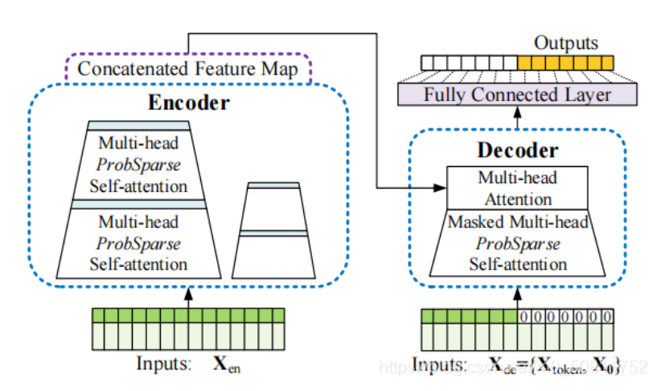
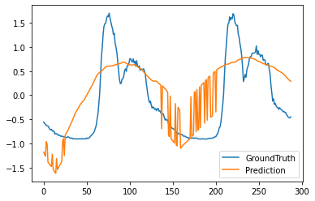
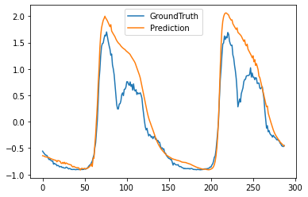

# Informer模型算法总结

## 1 介绍

- Informer，全称Informer: Beyond Efficient Transformer for Long Sequence Time-Series Forecasting 也就是针对长时序预测的高效率Transformer
- 代码仓库: https://github.com/zhouhaoyi/Informer2020
- 论文: https://arxiv.org/abs/2012.07436

Informer模型概述。左：编码器接收大量的长序列输入（绿色序列）。我们用所提出的主动火花自我注意来代替规范的自我注意。蓝色梯形是提取主导注意力的自我注意力提取操作，大大减小了网络规模。层叠加复制副本增加了鲁棒性。右：解码器接收长序列输入，将目标元素填充为零，测量特征图的加权注意力组成，并立即以生成方式预测输出元素（橙色系列）

## 2 实验结果

### 2.1 pollution数据集
| 优化方案                           | 参数                                  | MSE    |
| ---------------------------------- | ------------------------------------- | ------ |
| 无优化，不进行调参                 | seq_len=72, label_len=36, pred_len=24 | 0.5627 |
| 优化维度，删除wnd_dir和wind snow列 | seq_len=72, label_len=36, pred_len=24 | 0.2799 |
| 优化维度，输入参数下调             | seq_len=48, label_len=24, pred_len=24 | 0.2629 |

### 2.2 运维数据集

## 2.2.1 Test1: 30min prediction with 60min input length within 3 months on multivariate

采取每分钟1个数据点，取3个月的数据

|Rows|Value|
|----------|-----|
|total rows|129600|
|train|90631|
|val|12931|
|test|25891|

|Parameters|Value|
|----------|-----|
|dimension|2|
|seq_len|60|
|label_len|30|
|pred_len|30|
|inverse|False|
|others|default|

|Evaluation|Value|
|----------|---------|
|speed|0.1429s/iter|
|time cost per Epoch|406s|
|MSE|0.07224|
|MAE|0.04941|

#### 2.2.2 Experiment2: 1d prediction with 2d input length within 3 months on univariate

采取每10分钟1个数据点，取3个月的数据

|Rows|Value|
|----------|-----|
|total rows|12960|
|train|8641|
|val|1153|
|test|2449|

|Parameters|Value|
|----------|-----|
|dimension|2|
|seq_len|288|
|label_len|144|
|pred_len|144|
|inverse|False|
|features|S|
|others|default|

|Evaluation|Value|
|----------|---------|
|speed|0.2858s/iter|
|time cost per Epoch|75.77s|
|MSE|0.11456|
|MAE|0.22674|

#### 2.2.3 Experiment3: 2d prediction with 2d input length within 3 months on univariate

采取每10分钟1个数据点，取3个月的数据

|Rows|Value|
|----------|-----|
|total rows|12960|
|train|8641|
|val|1153|
|test|2449|

|Parameters|Value|
|----------|-----|
|dimension|2|
|seq_len|288|
|label_len|144|
|pred_len|288|
|inverse|False|
|features|S|
|others|default|

|Evaluation|Value|
|----------|---------|
|speed|0.7545s/iter|
|time cost per Epoch|198.46s|
|MSE|0.5007|
|MAE|0.5720|

#### 2.2.4 Experiment4: 2d prediction with 3d input length within 3 months on univariate

采取每10分钟1个数据点，取3个月的数据

|Rows|Value|
|----------|-----|
|total rows|12960|
|train|8641|
|val|1153|
|test|2449|

|Parameters|Value|
|----------|-----|
|dimension|2|
|seq_len|432|
|label_len|144|
|pred_len|288|
|inverse|False|
|features|S|
|others|default|

|Evaluation|Value|
|----------|---------|
|speed|0.9403s/iter|
|time cost per Epoch|246.80s|
|MSE|0.1707|
|MAE|0.2560|

## 3 代码与运行文档

### 3.1 Quick Start

- 访问 https://colab.research.google.com/drive/1_X7O2BkFLvqyCdZzDZvV2MB0aAvYALLC
- 按照colab上的指导，逐步进行，在官方所提供的数据集上运行Informer

### 3.2 Custom Data

- 按照colab custom data部分，将所需数据上传到colab中
- 更换数据集时
  - 第一列必须是timestamp格式
  - 按照时间选择间隔，天、时、分
  - target维必须位于最后一列，并修改target与数据列一致
  - 修改enc_in和dec_in，与数据维度一致
- 调参
  - 主要需要调整seq_len, label_len, pred_len几个参数, 符合数据特征。
  

## 4 总结

- Informer的使用场景
  - 长序列时间序列预测(LSTF)要求该模型具有较高的预测能力，即能够有效地捕获输出和输入之间精确的长距离依赖耦合的能力。时间序列预测 (Time-Series Forecasting) 任务在工业界应用场景还是挺多的，比如银行的交易量预测、电力系统的用电量预测、云服务的访问量预测，如果能提前预测到未来一段时间内的访问量/用电量，就可以提前进行资源部署，防止访问量过大耗尽现有计算资源，拖垮服务。
- 优点
  - AAAI 2021 Best Paper
  - 文档极其详尽，很容易复现结果
  - 提供了Example，便于快速上手
  - 大部分函数都进行了封装，只需要改动1小部分即可在自定义数据集上运行
- 缺点
  - 模型的时空复杂度与输入、输出长度相关，总长度需要控制在1000以内，否则会严重影响速度，无法进行teaching-force预测

