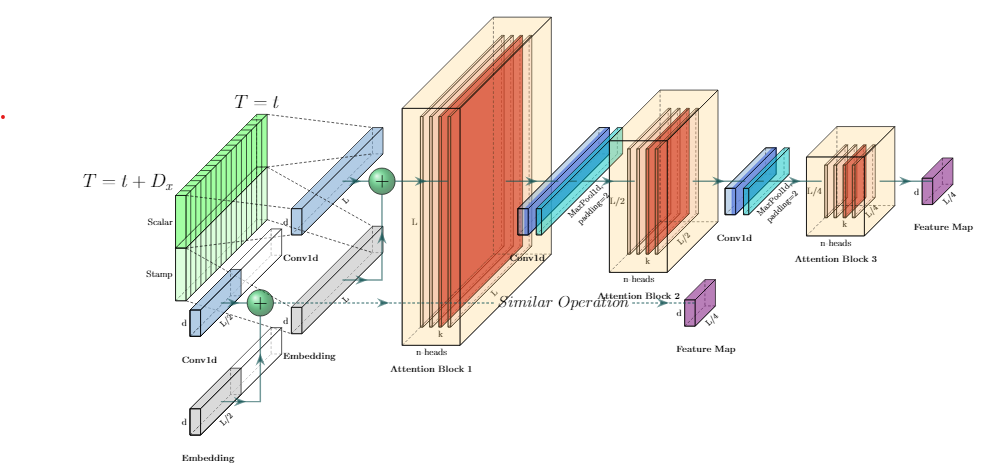

## Week1 - Deep Learning for Time Series Prediction

### 1 Notes

#### 1.1 Informer: Beyond Efficient Transformer for Long SequenceTime-Series Forecasting

##### Abstract

- LSTF demands: Long sequence time-series forecasting
- issues with applying Transformer to LSTF
  - quadratic time complexity
  - high memory usage
  - inherent limitation of the encoder-decoder architecture
- design an efficient model: Informer
  - $O(L\log(L))$
  - handles long input sequences
  - improves the inference speed of long-sequence predictions

##### Introduction

- The efficiency of the self-attention mechanism andTransformer framework becomes the bottleneck
- contributions
  - propose Informer to successfully enhance the pre-diction capacity in the LSTF problem
  - propose ProbSparseSelf-attention mechanism toefficiently replace the canonical self-attention
  - propose Self-attention Distilling operation privileges dominating attention scores in J-stacking layers
  - propose Generative Style Decoder to acquire longsequence output with only one forward step needed
- model
  - Encoder
    - receives massive long sequence inputs
  - Decoder
    - receives long sequence inputs, pads the target elements into zero

##### Preliminary
- input: $\{x_1^t,...,x_{L_x}^t | x_i^t \in \Reals^{d_x} \}$
  - $d_x$ represents for dimentions (>=1)
- output: $\{y_1^t,...,y_{L_y}^t | y_i^t \in \Reals^{d_y} \}$

##### Methodology

- Efficient Self-attention Mechanism
- Query Sparsity Measurement
  - Kullback-Leibler divergence
- ProbSparse Self-attention
  - Self-attention by allow-ing each key only to attend to the u dominant queries
- Architecture
  
- Encoder
  - Self-attention Distilling
- Decoder
  - Generative Inference
- Loss function
  - MSE loss function

##### Experiment

**Datasets**

- ETT(Electricity Transformer Temperature)
  - available
- ECL(Electricity Consuming Load)
- Weather

**Experimental Details**

- Baselines
- Hyper-parameter tuning

**Results**
- Univariate Time-series Forecasting
- Multivariate Time-series Forecasting

### 2 Code

#### 2.1 Informer2020

- Repository: [Informer2020](https://github.com/zhouhaoyi/Informer2020)
- Requirements
  - Python 3.6
  - matplotlib == 3.1.1
  - numpy == 1.19.4
  - pandas == 0.25.1
  - scikit_learn == 0.21.3
  - torch == 1.4.0
- Pros
  - paper implementation (AAAI'21 Best Paper)
  - example dataset available
  - Colab examples provided
  - capable of long sequence forecasting
  - detailed document
  - well-maintained (last update in Feb 22, 2021)
- Cons
  - complicated model

#### 2.2 latent_ode

- Repository: [latent_ode](https://github.com/YuliaRubanova/latent_ode)
- Requirements
  - torchdiffeq
- Pros
  - experiments on public datasets
  - auto download dataset
- Cons
  - targeting irregularly-sampled time series
  - interface for forecasting not provided

