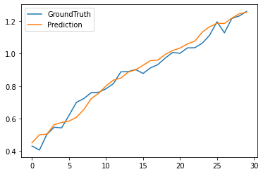
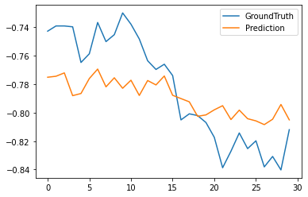
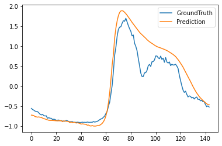
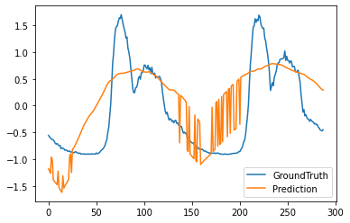
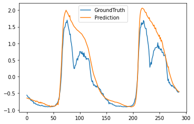

# Week6 Informer on TPS&ART dataset

## 1 Test1: 30min prediction with 60min input length within 3 months on multivariate

### 1.1 Data preprocess

采取每分钟1个数据点，取3个月的数据

|Rows|Value|
|----------|-----|
|total rows|129600|
|train|90631|
|val|12931|
|test|25891|

### 1.2 Hyper Parameters
|Parameters|Value|
|----------|-----|
|dimension|2|
|seq_len|60|
|label_len|30|
|pred_len|30|
|inverse|False|
|others|default|

### 1.3 Result

未做inverse变换
|Evaluation|Value|
|----------|---------|
|speed|0.1429s/iter|
|time cost per Epoch|406s|
|MSE|0.07224|
|MAE|0.04941|

## 2 Test2: 1d prediction with 2d input length within 3 months on univariate

### 2.1 Data preprocess

采取每10分钟1个数据点，取3个月的数据

|Rows|Value|
|----------|-----|
|total rows|12960|
|train|8641|
|val|1153|
|test|2449|

### 2.2 Hyper Parameters
|Parameters|Value|
|----------|-----|
|dimension|2|
|seq_len|288|
|label_len|144|
|pred_len|144|
|inverse|False|
|features|S|
|others|default|

### 2.3 Result

|Evaluation|Value|
|----------|---------|
|speed|0.2858s/iter|
|time cost per Epoch|75.77s|
|MSE|0.11456|
|MAE|0.22674|

## 3 Test3: 2d prediction with 2d input length within 3 months on univariate

### 3.1 Data preprocess

采取每10分钟1个数据点，取3个月的数据

|Rows|Value|
|----------|-----|
|total rows|12960|
|train|8641|
|val|1153|
|test|2449|

### 3.2 Hyper Parameters
|Parameters|Value|
|----------|-----|
|dimension|2|
|seq_len|288|
|label_len|144|
|pred_len|288|
|inverse|False|
|features|S|
|others|default|

### 3.3 Result

|Evaluation|Value|
|----------|---------|
|speed|0.7545s/iter|
|time cost per Epoch|198.46s|
|MSE|0.5007|
|MAE|0.5720|

## 4 Test4: 2d prediction with 3d input length within 3 months on univariate

### 4.1 Data preprocess

采取每10分钟1个数据点，取3个月的数据

|Rows|Value|
|----------|-----|
|total rows|12960|
|train|8641|
|val|1153|
|test|2449|

### 4.2 Hyper Parameters
|Parameters|Value|
|----------|-----|
|dimension|2|
|seq_len|432|
|label_len|144|
|pred_len|288|
|inverse|False|
|features|S|
|others|default|

### 4.3 Result

|Evaluation|Value|
|----------|---------|
|speed|0.9403s/iter|
|time cost per Epoch|246.80s|
|MSE|0.1707|
|MAE|0.2560|

