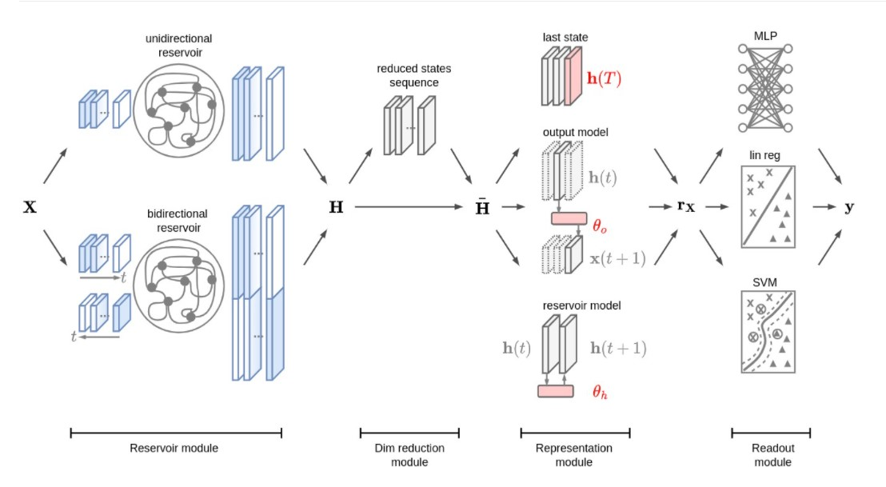

# Week8 Time Series Classification and Clustering

## 1 k-NN algorithm with dynamic time warping similarity measure

- repository: https://github.com/alexminnaar/time-series-classification-and-clustering
- introduction
  - The work of Dr. Eamonn Keogh at University of California Riverside has shown that a good way to classify time series is with a k-NN algorithm using a dynamic time warping similarity measure(in 2015).
  - 主要是引入了DTW算法来计算距离，随后根据这个来做KNN，属于传统方法。

### 1.1 Dynamic Time Warping(a.k.a DTW)

**note**
此处基于原DTW算法进行了优化，加入了参数w，降低了复杂度。

```python
def DTWDistance(s1, s2,w):
    # param: s1,s2 are series, w is window size
    DTW={}
    
    w = max(w, abs(len(s1)-len(s2)))
    
    for i in range(-1,len(s1)):
        for j in range(-1,len(s2)):
            DTW[(i, j)] = float('inf')
    DTW[(-1, -1)] = 0
  
    for i in range(len(s1)):
        for j in range(max(0, i-w), min(len(s2), i+w)):
            dist= (s1[i]-s2[j])**2
            DTW[(i, j)] = dist + min(DTW[(i-1, j)],DTW[(i, j-1)], DTW[(i-1, j-1)])
		
    return sqrt(DTW[len(s1)-1, len(s2)-1])
```


### 1.2 Apply K-NN to time series

```python
from sklearn.metrics import classification_report

def knn(train,test,w):
    preds=[]
    for ind,i in enumerate(test):
        min_dist=float('inf')
        closest_seq=[]
        #print ind
        for j in train:
            if LB_Keogh(i[:-1],j[:-1],5)<min_dist:
                dist=DTWDistance(i[:-1],j[:-1],w)
                if dist<min_dist:
                    min_dist=dist
                    closest_seq=j
        preds.append(closest_seq[-1])
    return classification_report(test[:,-1],preds)
```

### 1.3 Apply K-means to time series

```python
def k_means_clust(data,num_clust,num_iter,w=5):
    centroids=random.sample(data,num_clust)
    counter=0
    for n in range(num_iter):
        counter+=1
        print counter
        assignments={}
        #assign data points to clusters
        for ind,i in enumerate(data):
            min_dist=float('inf')
            closest_clust=None
            for c_ind,j in enumerate(centroids):
                if LB_Keogh(i,j,5)<min_dist:
                    cur_dist=DTWDistance(i,j,w)
                    if cur_dist<min_dist:
                        min_dist=cur_dist
                        closest_clust=c_ind
            if closest_clust in assignments:
                assignments[closest_clust].append(ind)
            else:
                assignments[closest_clust]=[]
    
        #recalculate centroids of clusters
        for key in assignments:
            clust_sum=0
            for k in assignments[key]:
                clust_sum=clust_sum+data[k]
            centroids[key]=[m/len(assignments[key]) for m in clust_sum]
    
    return centroids
```

## 2 Time series classification and clustering with Reservoir Computing

- repository: https://github.com/FilippoMB/Time-series-classification-and-clustering-with-Reservoir-Computing
- framework
  - 
- 支持多变量聚类问题，提供了numpy和mat格式的数据集
- 模型介绍有些模糊，不太好理解
- 文档中调用方式介绍较为清晰，也提供了notebook样例。


## 3 Time Series Distance

- repository: https://github.com/wannesm/dtaidistance
- 同样基于DTW算法，提供接口，可以调用聚类算法，例如`scipy.cluster.hierarchy.linkage`

