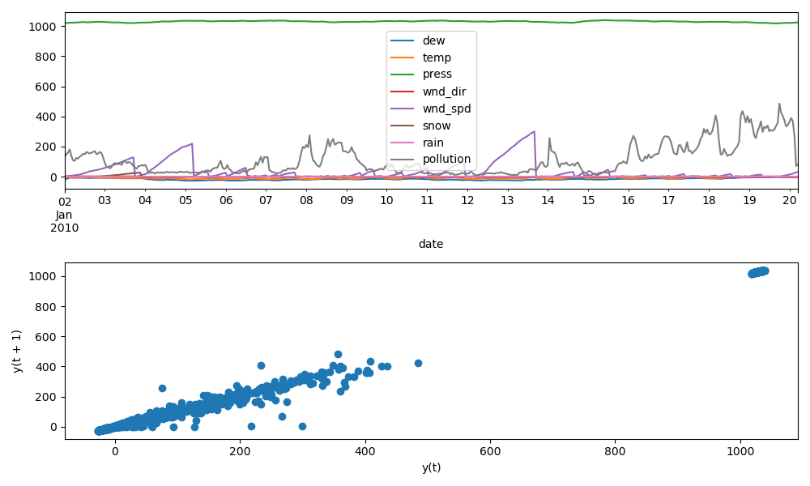
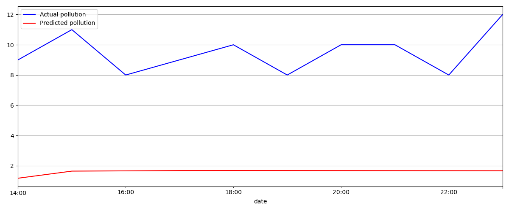

# 武信庭-第四周-VAR_stationarity

## 本周进度

对实验空气污染数据集进行一阶差分并判断其平稳性

### 1. 对原数据进行一阶差分

差分变换是去除时间序列中系统结构的一种简单方法。我们将通过从序列中的每个值中减去前一个值来消除趋势，这就是一阶差分。简单来说，我们将做的一阶差分，即如果我们对n个时间序列有一个综合阶数，如果我们对差分和时间取一阶，我们将留下序列综合阶数为零。

实现代码如下：

```python
train_diff = train.diff().dropna()
print(train_diff)
train_diff.plot(figsize=(10, 6))
plt.show()
```


### 2. ADF检验

利用ADF检验，在一阶差分前后分别检验变量平稳性

实现代码如下：

```python
def adf(time_series):
    result= ts.adfuller(time_series.values)
    print(' ADF statistic:%f' % result[0])
    print(' p-value:%f' % result[1])
    print(' Critical Values:')
    for key, value in result[4]. items():
        print('\t%s:%.3f' % (key, value))
```

在得到ADF检验结果后如何确定该序列能否平稳，主要可以看两点：

1. 1%、%5、%10不同程度拒绝原假设的统计值和ADF Test result的比较，ADF Test result同时小于1%、5%、10%即说明非常好地拒绝该假设
2. P-value是否非常接近0


### 3. Granger causality检验

使用Granger causality检验来判断一个序列是否对预测另一个序列有用

接收一个包含2列的2维的数组作为主要参数：
第一列是当前要预测未来值的序列A，第二列是另一个序列B,该方法就是看B对A的预测是否有帮助。

该方法的零假设是：B对A没有帮助。如果所有检验下的P-Values都小于显著水平0.05，则可以拒绝零假设，并推断出B确实对A的预测有用。

实现代码如下：

```python
print(grangercausalitytests(train_diff[['dew', 'pollution']],
                            maxlag=15, addconst=True, verbose=True))
print(grangercausalitytests(train_diff[['temp', 'pollution']],
                            maxlag=15, addconst=True, verbose=True))
print(grangercausalitytests(train_diff[['press', 'pollution']],
                            maxlag=15, addconst=True, verbose=True))
print(grangercausalitytests(train_diff[['wnd_dir', 'pollution']],
                            maxlag=15, addconst=True, verbose=True))
print(grangercausalitytests(train_diff[['wnd_spd', 'pollution']],
                            maxlag=15, addconst=True, verbose=True))
print(grangercausalitytests(train_diff[['snow', 'pollution']],
                            maxlag=15, addconst=True, verbose=True))
print(grangercausalitytests(train_diff[['rain', 'pollution']],
                            maxlag=15, addconst=True, verbose=True))
```


实验结果：

```python
MAE:7.875351
MSE:63.652026
RMSE:7.978222
```



