# 武信庭-第六周-Detector

## 本周进度

阅读adtk库中Detector部分文档的API说明，根据仓库提供jupyter notebook完成demo，并总结归纳API功能

### 1. ThresholdAD

通过设定阈值检测每个时间序列值中的异常点

低于低阈值与高于高阈值的值被认为是异常值

#### 参数：

- high：高阈值
- low：低阈值

```python
from adtk.detector import ThresholdAD
threshold_ad = ThresholdAD(high=30, low=15)
```

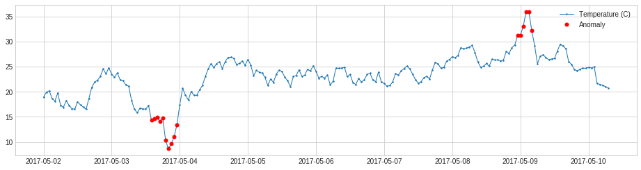


### 2. QuantileAD

通过设定将时间序列值与用户指定的历史数据量子值进行比较检测异常点

低于低分位数与高于高分位数的值被认为是异常值

#### 参数：

- high：高分位数
- low：低分位数

```python
from adtk.detector import QuantileAD
quantile_ad = QuantileAD(high=0.99, low=0.01)
```

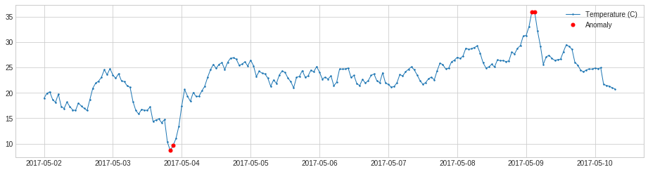


### 3. InterQuartileRangeAD

基于 Interquartile Range (IQR)，检测不在[*Q*1−*c*×*IQR*, *Q*3+*c*×*IQR*] ，*IQR*=*Q*3−*Q*1，IQR是25%和75%百分位之间的差值。

在训练数据中只有极小部分甚至没有异常的情况下，这种检测器通常优于QuantileAD

#### 参数：

- c：IQR公式中参数，用于决定正常值范围界限

```python
from adtk.detector import InterQuartileRangeAD
iqr_ad = InterQuartileRangeAD(c=1.5)
```

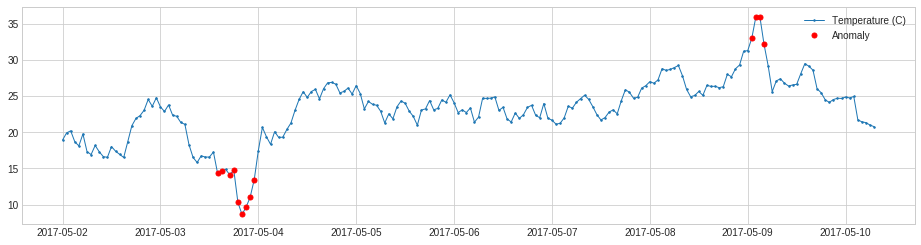


### 4. GeneralizedESDTestAD

基于extreme Studentized deviate (ESD) 检测异常，用于从正态分布的变量中检测离群点。

但ESD检测只有在遵循近似正态分布的条件下可用

#### 参数：

- alpha：显著性水平，ESD测试中假设有大于*α*的可能性存在离群点以此统计

```python
from adtk.detector import GeneralizedESDTestAD
esd_ad = GeneralizedESDTestAD(alpha=0.3)
```

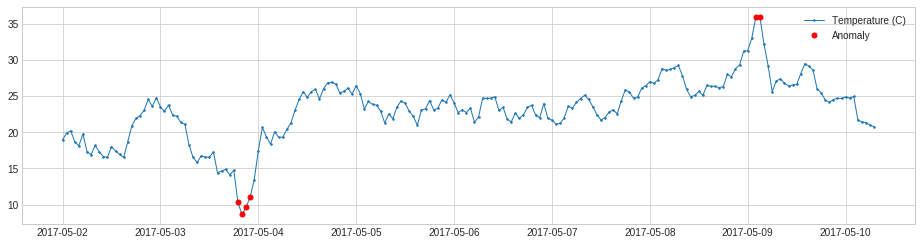

ESD详细定义见：

https://blog.csdn.net/huangbo10/article/details/51942006

https://www.itl.nist.gov/div898/handbook/eda/section3/eda35h3.html


### 5. PersistAD

将每个时间序列值与它之前的值比较检测异常点，该检测器将时间序列值与前一个时间窗口的值进行比较，如果与前一个平均值或中位数的值变化异常大，则确定一个时间点为异常点。

它通常能在在短期上很好地捕捉了异常，但有时在长期上效果不佳，此时可以调整窗口大小来检测较为长期的异常，如下二图所示

#### 参数：

- window：时间窗口大小
- c：用于根据历史四分位数决定正常范围界限（c越小异常范围判定界限越松）
- side：决定检测异常正/负变化
- min_periods：每个窗口中具有该窗口值所需的最小观测数（默认为所有观测值必须有值）
- agg：决定使用中位数还是平均值判断异常（默认为中位数）

```python
from adtk.detector import PersistAD
persist_ad = PersistAD(window=1, c=1.5, side='positive')
persist_ad.window = 24 # 调整窗口大小
```

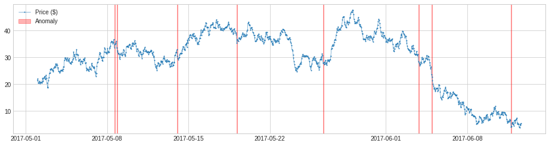

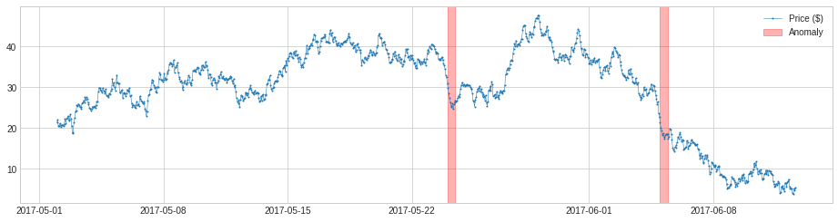


### 6. LevelShiftAD

通过跟踪相邻两个滑动时间窗口的中位值之间的差异来检测数值异常的变化。它对瞬时尖峰不敏感，如果嘈杂的异常值频繁发生，它可能是一个不错的选择

如果两个时间窗口的中位数差异异常大，则将中间的时间点确定为异常点

#### 参数：

- window：时间窗口大小
- c：用于根据历史四分位数决定正常范围界限（c越小异常范围判定界限越松）
- side：决定检测异常正/负变化
- min_periods：每个窗口中具有该窗口值所需的最小观测数（默认为所有观测值必须有值）

```python
from adtk.detector import LevelShiftAD
level_shift_ad = LevelShiftAD(c=6.0, side='both', window=5)
```

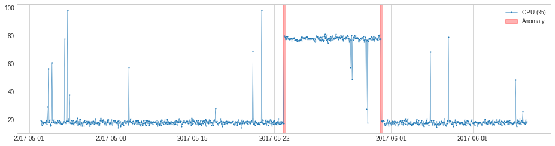


### 7. VolatilityShiftAD

通过跟踪相邻两个滑动时间窗口的标准差来检测波动异常的变化

#### 参数：

- window：时间窗口大小
- c：用于根据历史四分位数决定正常范围界限（c越小异常范围判定界限越松）
- side：决定检测异常正/负变化
- min_periods：每个窗口中具有该窗口值所需的最小观测数（默认为所有观测值必须有值）

```python
from adtk.detector import VolatilityShiftAD
volatility_shift_ad = VolatilityShiftAD(c=6.0, side='positive', window=30)
```

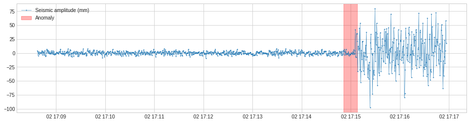


### 8. SeasonalAD

用于检测季节性模式中的异常值

该检测器使用季节分解变换器去除季节性模式，当季节分解的残差异常大时，将某一时间点识别为异常值。

#### 参数：

- freq：季节性周期的长度，一个周期中的时间点数量。如果没有指定，模型将尝试根据训练序列的自相关来确定
- c：用于根据历史四分位数决定正常范围界限（c越小异常范围判定界限越松）
- side：决定检测异常正/负变化
- trend：分解过程中是否要提取趋势

```python
from adtk.detector import SeasonalAD
seasonal_ad = SeasonalAD(c=3.0, side="both")
```

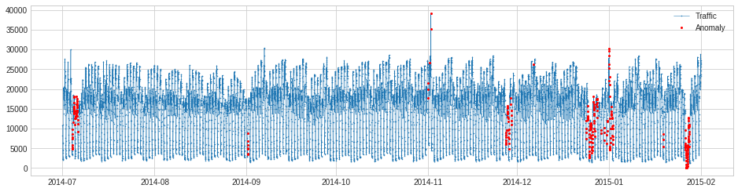


### 9. AutoregressionAD

检测时间序列中自回归行为的异常变化

应用回归器学习时间序列的自回归特性，当自回归的残差异常大时，将某一时间点识别为异常点

#### 参数：

- n_steps：模型包含的步数
- step_size：步数长度，举例来看就是当n_steps=2, step_size=3时，X[t-3] 和 X[t-6]将会被用来预测X[t]
- regressor：要使用的回归器，和scikit-learn的回归器一样有最小的拟合和预测方法。默认使用线性回归器
- c：用于根据历史四分位数决定正常范围界限（c越小异常范围判定界限越松）
- side：决定检测异常正/负变化

```python
from adtk.detector import AutoregressionAD
autoregression_ad = AutoregressionAD(n_steps=7*2, step_size=24, c=3.0)
```

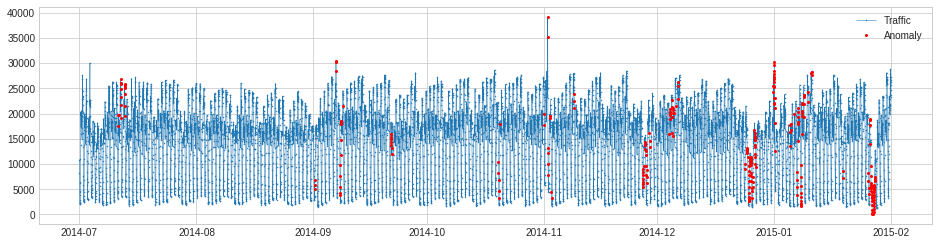


### 10. MinClusterDetector

将多指标时间序列视为高维空间中的独立点，将他们划分进聚类，并将最小的聚类中的值视为异常点

#### 参数：

- model：用于建立聚类的模型算法

```python
from adtk.detector import MinClusterDetector
from sklearn.cluster import KMeans
min_cluster_detector = MinClusterDetector(KMeans(n_clusters=3))
```


### 11. OutlierDetector

基于离群点检测模型，利用给定算法检测异常点

#### 参数：

- model：用于检测离群点的模型算法

```python
from adtk.detector import OutlierDetector
from sklearn.neighbors import LocalOutlierFactor
outlier_detector = OutlierDetector(LocalOutlierFactor(contamination=0.05))
```

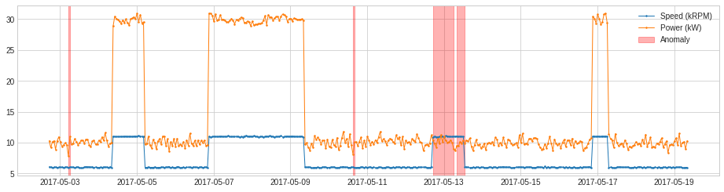


### 12. RegressionAD

通过回归建立目标序列与其他序列间关系，当回归残差异常大时将该点确定为异常点

#### 参数：

- target：作为目标变量的列名
- regressor：使用的回归器
- c：用于根据历史四分位数决定正常范围界限（c越小异常范围判定界限越松）
- side：决定检测异常正/负变化

```python
from adtk.detector import RegressionAD
from sklearn.linear_model import LinearRegression
regression_ad = RegressionAD(regressor=LinearRegression(), target="Speed (kRPM)", c=3.0)
```


### 13. PcaAD

对多变量时间序列进行主成分分析，即principal component analysis (PCA) ，跟踪这些点的重建误差，并将重建误差异常大的点作为异常点

#### 参数：

- k：使用的主成分个数
- c：用于根据历史四分位数决定正常范围界限（c越小异常范围判定界限越松）

```python
from adtk.detector import PcaAD
pca_ad = PcaAD(k=1)
```

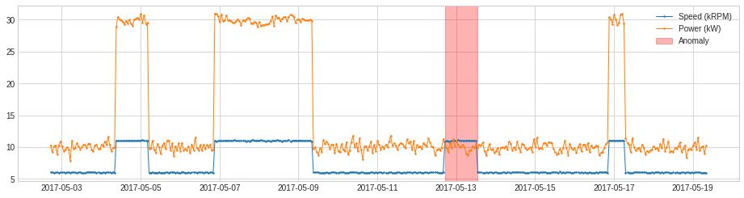


### 14. CustomizedDetector

使用自定义函数来检测异常点

#### 参数：

- detect_func：异常检测函数
- detect_func_params：异常检测函数参数
- fit_func：一个用时间序列训练检测函数参数（detect_func_params）的函数
- fit_func_params：fit_func的参数

```python
def myDetectionFunc(df):
    return (df["Speed (kRPM)"] * 1.2 > df["Power (kW)"])

from adtk.detector import CustomizedDetectorHD
customized_detector = CustomizedDetectorHD(detect_func=myDetectionFunc)
```

