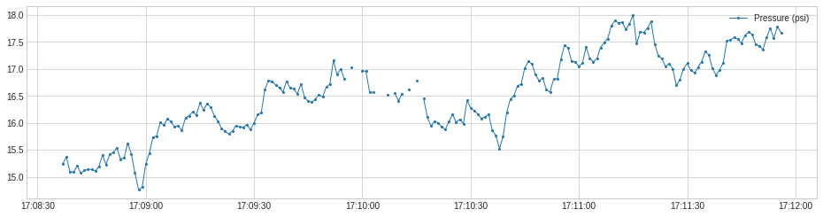

# 武信庭-第七周-Transformer

## 本周进度

阅读adtk库中Transformer部分文档的API说明，根据仓库提供jupyter notebook完成demo，并总结归纳API功能

### 1. RollingAggregate

沿着一个时间序列滚动一个滑动窗口，并使用一个选定的操作进行聚合

#### 参数：

- window：窗口大小
- agg：聚合方法，可选均值、中位值、总数等
- agg_params：聚合方法的参数
- center：决定计算在时间窗口中心或右侧
- min_periods：每个窗口中具有该窗口值所需的最小观测数（默认为所有观测值必须有值）

```python
from adtk.transformer import RollingAggregate
s_transformed = RollingAggregate(agg='count', window=5).transform(s)
```

例子中沿着时间序列跟踪有效值的滚动计数，这可能有助于在缺失值频繁出现时引起警报。




### 2. DoubleRollingAggregate

沿着一个时间序列并排滚动两个滑动窗口，使用选定的操作进行聚合，并跟踪两个窗口之间聚合指标的差异，可能有助于跟踪时间序列中统计行为变化。

#### 参数：

- window：窗口大小
- agg：聚合方法，可选均值、中位值、总数等
- agg_params：聚合方法的参数
- center：决定计算在时间窗口中心或右侧
- min_periods：每个窗口中具有该窗口值所需的最小观测数（默认为所有观测值必须有值）
- diff：在两个滑动窗口的聚合度量之间应用的差值法，可选差、绝对差、平方根等

对系列值的统计分布变化的追踪：

```python
from adtk.transformer import DoubleRollingAggregate
s_transformed = DoubleRollingAggregate(
    agg="quantile",
    agg_params={"q": [0.1, 0.5, 0.9]},
    window=50,
    diff="l2").transform(s)
```


对值水平转变的追踪：

```python
from adtk.transformer import DoubleRollingAggregate
s_transformed = DoubleRollingAggregate(
    agg="median",
    window=5,
    diff="diff").transform(s)
```


### 3. ClassicSeasonalDecomposition

将一个序列分解为趋势部分、季节部分和残差部分。它用移动平均数计算并去除趋势成分，通过取去趋势序列的季节性时期的平均值来提取季节性模式，并返回残差序列。

残差部分可能有助于识别对季节性模式的异常偏离

#### 参数：

- freq：季节循环长度（一次循环中的时间点数量）
- trend：是否通过移动平均值来分解并提取序列趋势，默认关闭

```python
from adtk.transformer import ClassicSeasonalDecomposition
s_transformed = ClassicSeasonalDecomposition().fit_transform(s)
```


不提取趋势的ClassicSeasonalDecomposition不能处理长期趋势与季节性模式以及噪声混合的情况。在这些情况下，应该打开趋势选项。

在下面的例子中，如果没有打开趋势选项，ClassicSeasonalDecomposition就不能分解残余序列和合成序列的长期趋势。

```python
s_transformed = ClassicSeasonalDecomposition(freq=7).fit_transform(s)
```


我们打开模型的趋势选项，并重新适用于上述相同的例子，其中残差与趋势是分开的

```python
s_transformed = ClassicSeasonalDecomposition(freq=7, trend=True).fit_transform(s)
```


### 4. Retrospect

返回具有回溯值的数据框，即时间t的一行包括(t-k)的值，其中k是由用户指定的

对于需要考虑滞后效应的情况可能很有用

#### 参数：

- n_steps：回溯步数
- step_size：回溯步数的长度
- till：最近回溯步

```python
from adtk.transformer import Retrospect
df = Retrospect(n_steps=4, step_size=20, till=50).transform(s)
```


### 5. RegressionResidual

对一个多变量序列进行回归，并返回回归残差

可能有助于识别违反系列之间普遍关系的异常

#### 参数：

- regressor：使用的回归器
- target：作为目标变量的列名

```python
from adtk.transformer import RegressionResidual
s = RegressionResidual(regressor=LinearRegression(), target="Speed (kRPM)").fit_transform(df)
```


### 6. PcaProjection

将一个多变量序列转换为具有前k个主成分的表示

即对多变量时间序列进行主成分分析（PCA）（每个时间点都被视为高维空间中的一个点），并用它们在前k个主成分上的投影来表示这些点。

#### 参数：

- k：使用的主成分个数

```python
from adtk.transformer import PcaProjection
s = PcaProjection(k=1).fit_transform(df)
```


### 7. PcaReconstruction

对多变量时间序列进行主成分分析（PCA）的转化器（每个时间点都被视为高维空间中的一个点），并以前k个主成分重建这些点。

#### 参数：

- k：使用的主成分个数

```python
from adtk.transformer import PcaReconstruction
df_transformed = PcaReconstruction(k=1).fit_transform(df)
```


### 8. PcaReconstructionError

对多变量时间序列进行主成分分析（PCA），每个时间点都被视为高维空间中的一个点，用前k个主成分重建这些点，并返回重建误差（即重建点与原始点之间的平方距离）

#### 参数：

- k：使用的主成分个数

```python
from adtk.transformer import PcaReconstructionError
s = PcaReconstructionError(k=1).fit_transform(df)
```


### 9. CustomizedTransformer

用户以自定义函数定义一个转化器

#### 参数：

- transform_func：转化函数
- transform_func_params：转化函数参数
- fit_func：一个用时间序列训练检测函数参数（transform_func_params）的函数
- fit_func_params：fit_func的参数

```python
def myTransformationFunc(df):
    return (df["Power (kW)"] / df["Speed (kRPM)"]).rename("Power/Speed (kW/kRPM)")

from adtk.transformer import CustomizedTransformerHD
customized_transformer = CustomizedTransformerHD(transform_func=myTransformationFunc)
s = customized_transformer.transform(df)
```


