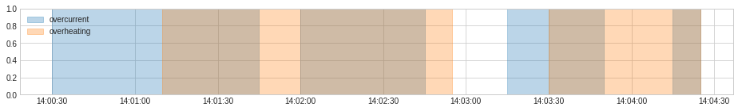
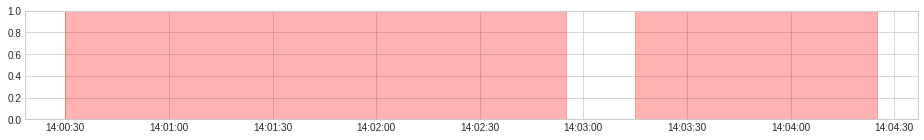
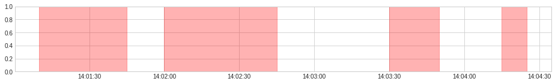

# 武信庭-第八周-Aggregator

## 本周进度

阅读adtk库中Aggregator部分文档的API说明，根据仓库提供jupyter notebook完成demo，并总结归纳API功能

### 1. OrAggregator

将被包括在任一个输入异常列表中的一个时间点认定为异常，即做“或”操作

#### 参数：

- lists：要聚合的异常列表

可以应用于合并二进制序列格式的异常情况：

```python
from adtk.aggregator import OrAggregator

anomaly = pd.DataFrame(
    np.array(
        [[False, True, True, False, False],
         [False, False, True, True, False]]).T,
    columns=["overcurrent", "overheating"],
    index=pd.date_range(start="2019-12-7 14:00:00", periods=5, freq="min"))

OrAggregator().aggregate(anomaly)
```

原序列：

|                     | overcurrent | overheating |
| ------------------- | ----------- | ----------- |
| 2019-12-07 14:00:00 | False       | False       |
| 2019-12-07 14:01:00 | True        | False       |
| 2019-12-07 14:02:00 | True        | True        |
| 2019-12-07 14:03:00 | False       | True        |
| 2019-12-07 14:04:00 | False       | False       |

合并结果：

|                     | result |
| ------------------- | ------ |
| 2019-12-07 14:00:00 | False  |
| 2019-12-07 14:01:00 | True   |
| 2019-12-07 14:02:00 | True   |
| 2019-12-07 14:03:00 | True   |
| 2019-12-07 14:04:00 | False  |

也可用于合并事件列表序列的异常情况：






### 2. AndAggregator

将被包括在每一个输入异常列表中的一个时间点认定为异常，即做“和”操作

#### 参数：

- lists：要聚合的异常列表

同样可以应用于合并二进制序列格式与事件列表序列的异常情况：

```python
from adtk.aggregator import AndAggregator
AndAggregator().aggregate(anomaly)
```

|                     | overcurrent | overheating |
| ------------------- | ----------- | ----------- |
| 2019-12-07 14:00:00 | False       | False       |
| 2019-12-07 14:01:00 | True        | False       |
| 2019-12-07 14:02:00 | True        | True        |
| 2019-12-07 14:03:00 | False       | True        |
| 2019-12-07 14:04:00 | False       | False       |

结果：

|                          | result |
| ------------------------ | ------ |
| 2019-12-07 14:00:00      | False  |
| 2019-12-07 14:01:00      | False  |
| 2019-12-07 14:02:00      | True   |
| 2019-12-07 14:03:00      | False  |
| 2019-12-07 14:04:00False | False  |


